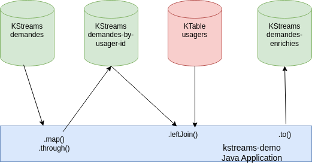

# Démo KStreams

## Mise en oeuvre

Pré-requis : Git et Maven.

Cloner le projet git :

```bash
git clone https://github.com/chvois1/kstreams-demo.git
```

Builder le projet :

```bash
cd kstreams-demo
mvn package
```

Lancer le cluster :

```bash
cd docker
docker compose up 
```

## KStream vs KTable

Deux types de streams existent dans les API fournies par kafka: les KStreams et les KTables. Les KTables sont des Streams finis, ou encore selon la nomenclature de Kafka des streams compactés. Alors qu’un KStream représente un topic Kafka infini, une KTable est un topic pour lequel chaque nouveau message clé/valeur écrase l’ancien message avec la même clé, ou insère le message si la clé est nouvelle. Il s'agit d'une Map <clé,valeur>.


### Produits/Libellés

Probléème: associer une table d'identifiants produits avec les libellés des produits correspondants.  

Un référentiel de mappings entre des identifiants de produits et les libellés associés peut être représenté par une KTable. Si l’on décide de mettre à jour le libellé d’un produit du référentiel, l’injection d’un nouveau message écrasera l’ancien. La politique de log compaction de Kafka nous garantit que nos tuples ne seront pas effacés, contrairement à un topic non compacté qui voit ses messages effacés après 7 jours, par défaut.

Lorsqu’une application travaillant avec des KTables démarre, elle lit entièrement le topic depuis l’offset où elle s’était arrêtée (de la fin par défaut, si elle démarre pour la première fois), puis stocke les messages dans une instance RocksDB qui est un cache persisté et local à chaque JVM. Elle reste ensuite à l’écoute du topic pour insérer tout nouveau message dans son cache.

Pour une instance d’une application KStreams, joindre un KStream(topic achats) et une KTable(topic referentiel) revient donc à :

- lire et mémoriser dans un cache l’ensemble des partitions assignées du topic réferentiel.
- joindre chaque tuple provenant des partitions assignées du topic achats à la volée avec un tuple de la KTable référentiel.



## Démonstration

### Créer les topics

```bash
docker exec $(docker ps | grep kafka | awk {'print $1'} | head -1) bash -c "/opt/scripts/create-topics.sh"
```

### Référentiel

Injecter des produits dans le topic `referentiel` :

```bash
docker exec $(docker ps | grep kafka | awk {'print $1'} | head -1) bash -c "/opt/scripts/inject-referentiel.sh"
```

Cela injecte les messages (clé,valeur) suivants dans le référentiel :

```bash
1,{"id":1, "name":"produit1"}
2,{"id":2, "name":"produit2"}
3,{"id":3, "name":"produit3"}
```

### Achats

Injecter des produits dans le topic `achats` :

```bash
docker exec $(docker ps | grep kafka | awk {'print $1'} | head -1) bash -c "/opt/scripts/inject-achats.sh"
```

Cela injecte les messages suivants dans le flux des achats :

```bash
{"id": 1, "price": 3.45}
{"id": 2, "price": 13.40}
{"id": 30, "price": 1.05}
{"id": 1, "price": 3.40}
```

Ici la clé n'est pas présente, ce qui revient à produire le message dans une partition aléatoire.

### Résultat

Consommer les messages présents dans le topic `achats-enrichis` :

```bash
    docker exec $(docker ps | grep kafka | awk {'print $1'} | head -1) bash -c "/opt/scripts/consume-output.sh"
```

Output :

```bash
{"id":2,"name":"produit2","price":13.40}
{"id":30,"name":"REF INCONNUE","price":1.05}
{"id":1,"name":"produit1","price":3.40}
{"id":1,"name":"produit1","price":3.45}
```

On voit que les achats ont été enrichis du libellé produit grâce au référentiel.
